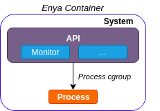

# enya

enya builds on [railcar](https://github.com/oracle/railcar), an OCI compliant container runtime, to form a Special Purpose Container Runtime.

Any general additions will be contributed upstream.

# Overview

  

enya initializes pid 1 as the **System** process (similar to init process in railcar). 
The System process constructs two separate cgroups, one for itself and the container application.
It then places the actual container **Process** (child) into a new cgroup, in order to have full control of the running container binary.

# Features

## Metric Subscription Service

Subscription service, where processes, local or non-local can subscribe to metric reports of the enya **Process**. Sure, it is technically possible 
to fetch the metrics from inside a standard container runtime (runc), but that data will not represent the actual resources that the container application is using.
It will also include the Memory/IO/CPU usage from the recurring collection of metrics. Also, it will require the application itself to include code for reading metrics from the cgroup subsystems.

Possible use cases:

*   Dynamic scheduling decisions, where applications can rely on fine-grained resource metrics and not only a task queue threshold.
*   To avoid the container being OOM killed, applications may take action, i.e., spill in-memory state to disk.

## Traffic Control (Planned)

Enable more advanced traffic strategies, which can be enabled at startup or on the fly during runtime.

# API

The [API](api/protobuf/messages.proto) is defined in Protobuf (version 3) and currently supports [kompact](https://github.com/kompics/kompact). However, it can be extended to gRPC as well.

# License

enya is licensed under Apache License 2.0.

See [LICENSE](LICENSE) for more details.
